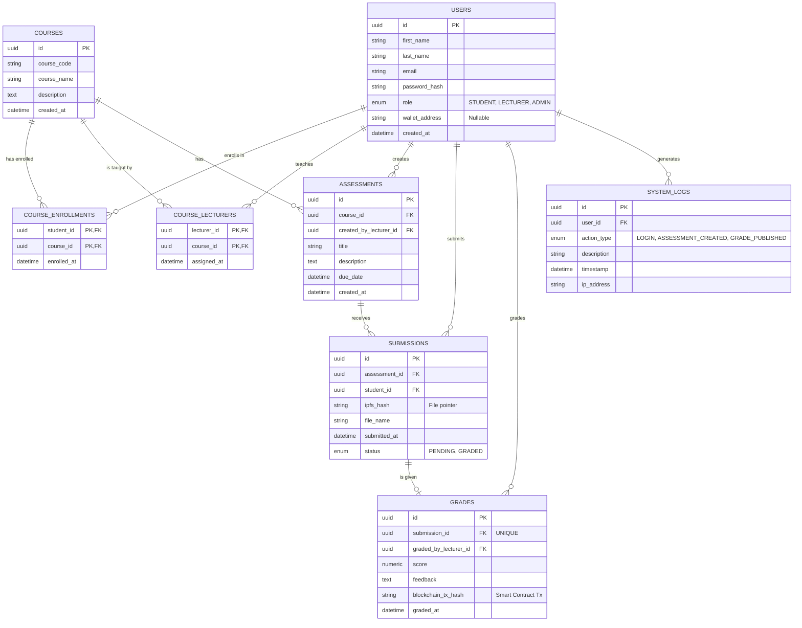

# EduChain Database Schema

The following Entity-Relationship Diagram outlines the normalized database schema (3NF) designed for the Blockchain Security Framework for an Online Student Evaluation System.

This schema acts as a hybrid bridge, connecting traditional relational data (users, courses, metadata) with Web3 decentralized storage (IPFS hashes for submissions) and immutable ledger records (Ethereum transaction hashes for grades).

